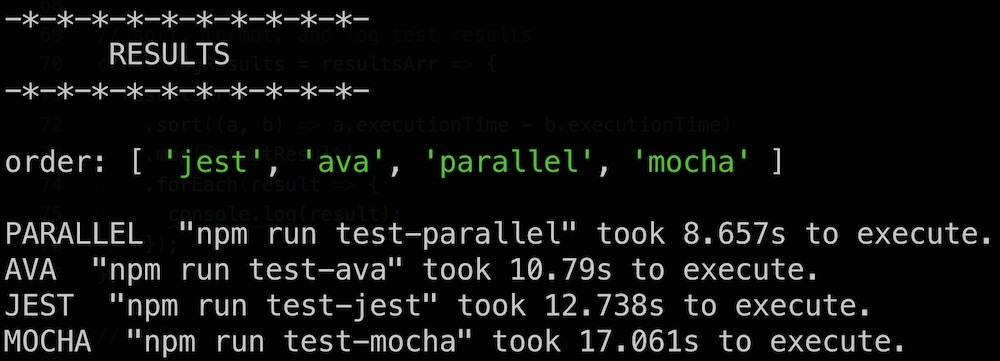

# Comparing JavaScript Test Runners

JavaScript test runners for comparison:

- AVA
- Jest
- Mocha (and an interesting wrapper called `mocha-parallel-tests`)

This repo contains two things:

1. A node application that has the capability of running tests in all these frameworks. [Documentation Permalink](https://github.com/scraggo/comparing-javascript-test-runners/blob/master/docs/test-runner.md)
2. [A companion article](https://github.com/scraggo/comparing-javascript-test-runners/blob/master/README.md) that does an in-depth comparison of these frameworks and gives context about the motivation behind this application. [Permalink](https://github.com/scraggo/comparing-javascript-test-runners/blob/master/README.md)

## About the application

This application is a test-runner that can:

- create the same tests that are compatible with the testing frameworks above
- run those tests with a comparison of the times it takes to execute them

My goal was to create something similar to the [TodoMVC project](http://todomvc.com/) which compared the same "todo" app with different frameworks - React, Backbone, Ember, Vanilla, etc. For my test runner - I generate the same tests but with syntax that’s compatible with the test runners, capture the times it took to run, and output a report at the end.

The number and length of the authored tests simulate a "true" test run in a significantly sized enterprise codebase. Each test runner has a template that will run the _same exact_ test blocks and take the _same exact_ amount of time in each block. (This is done with a `setTimeout` with a time that increases with each iteration of the loop that generates the test block.)

To account for a bias in ordering, the scripts corresponding to each test runner are shuffled. This ensures that the suites for each test runner are never called in the same sequence.

## Running the tests

`npm install` to install all the packages.

`npm run clean` (optional) to clear out all the generated test files.

`npm run make-tests` to generate test files.

`npm run test-all` to run **all** the generated tests and see a diagnostic output.

`npm run test-ava` to run the generated `ava` tests

`npm run test-jest` to run the generated `jest` tests

`npm run test-mocha` to run the generated `mocha` tests

`npm run test-parallel` to run the generated `mocha-parallel-tests` tests

## Development

`npm run lint` to lint files.

`npm run test` to run the internal codebase tests.

## Want to contribute?

Found a typo? Want to add details or make a correction? This repo is open-source and your contributions are 100% welcome 💥.
